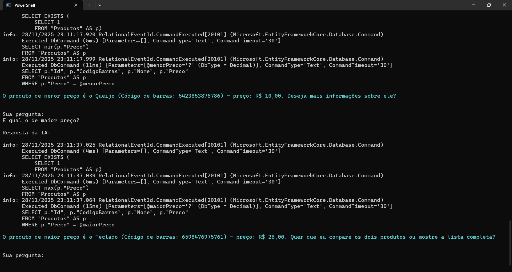
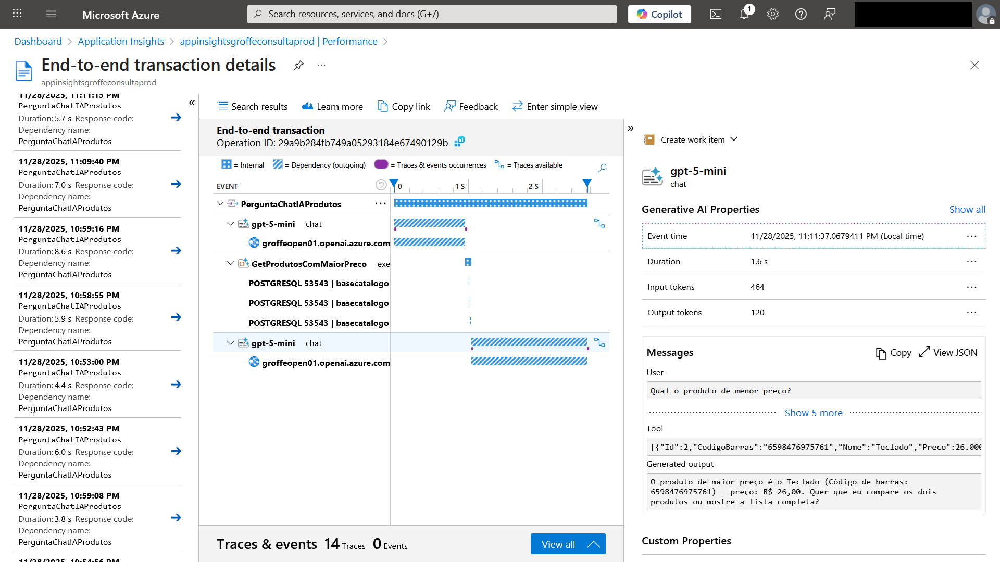

# dotnet10-semantickernel-postgres-testcontainers-otel-azureappinsights_consultaprodutos
Exemplo em .NET 10 de Console Application que faz uso do projeto Semantic Kernel, com integração com soluções de IA como Azure Open AI na consulta de informações de produtos em uma base PostgreSQL. Inclui o uso do Testcontainers para criação do ambiente de testes com os dados + monitoramento com Application Insights/Azure Monitor.

---

Aplicação em execução:

Trace no Azure Application Insights:

